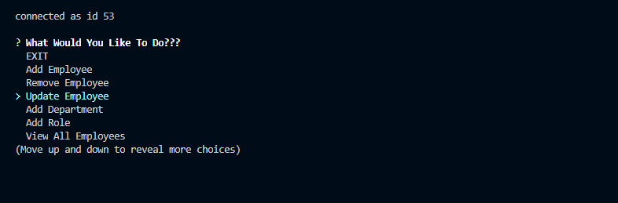
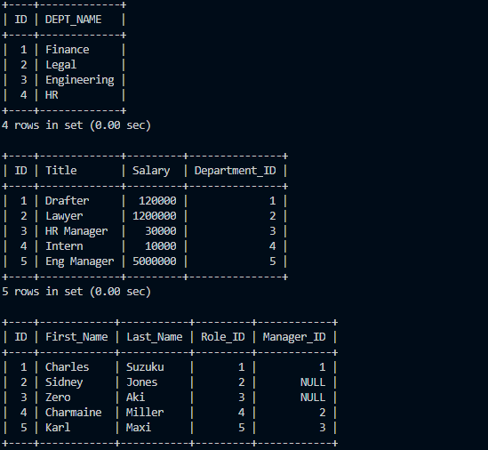

# EMPLOYEE-TRACKER
## **Description**
This is an application that will ask various promots in order to build a table displaying  various Employee information. This can output Employee Name, Role, Department, Manager and also can remove, update, and insert various data through mySQL.

This was a fun, yet time consuming project. The biggest challange I faced was the SQL syntax. It is so easy to miss a common, a capitaliztion, and even a word!

---
## **Tutorial**
[

Tutorial Video Link Here: [TUTORIAL!](https://drive.google.com/file/d/1mP4ZCxMn7GBUtnIXaKJxjvdAVLP1V-8q/view)
---
## Screenshots

---
## **Tools Used**

* VS Code
* NPM
* Inquirer
* MySQL
* NPM Console.Table
* Node.js

---

## **Resources**

* [Inquirer](https://www.npmjs.com/package/inquirer#prompt)
* [MySQL](https://www.npmjs.com/package/mysql)
* [ConT](https://www.npmjs.com/package/console.table)
* [MDN](https://developer.mozilla.org/en-US/docs/Web/JavaScript)
